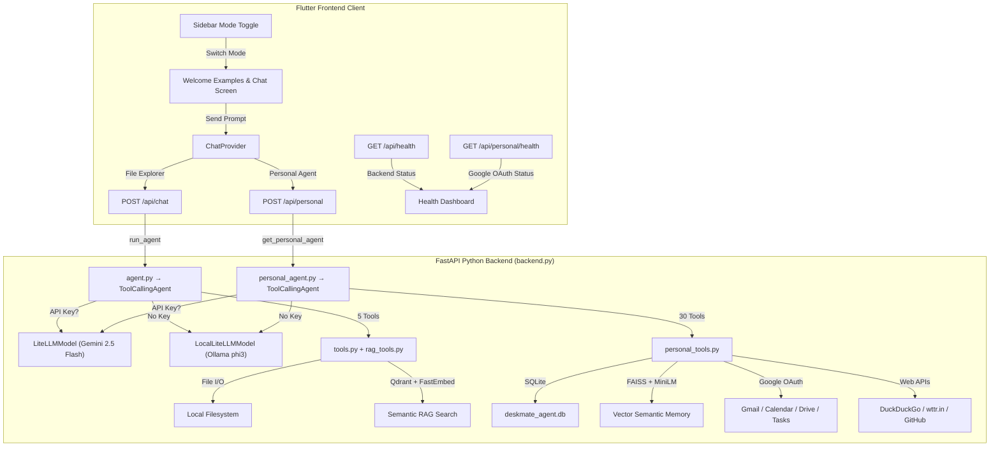

# DeskMate – Open-Source AI Desktop Copilot & Personal Assistant

Welcome to **DeskMate**! A powerful open-source local AI-driven desktop copilot and personal workspace assistant consisting of a **Python AI Backend** (powered by FastAPI, SmolAgents, Qdrant, and FAISS) and a beautiful **Flutter Desktop Frontend**.

By bundling the backend as a silent background process inside the Flutter application, **DeskMate runs completely offline, securely, and natively on the client's device without requiring a remote server deployment or manual Python environment setup!**

---

## Dual‑Mode AI Architecture

DeskMate features a unified **Dual-Engine Toggle** that switches seamlessly in real-time between two modes:



### Mode 1: File Explorer Copilot
An advanced filesystem agent with secure, direct local disk access:
* **Tools**: `read_file`, `list_directory`, `search_files`, `index_document`, `search_qdrant`
* **Semantic Search (RAG)**: Integrated Qdrant instance with local FastEmbed models for fully offline vector lookups.
* **Drive-letter fix**: Automatically normalises bare drive letters (`D:` → `D:\`) to prevent "Access Denied" errors on Windows.

### Mode 2: DeskMate Personal Agent
A comprehensive personal workspace assistant featuring **30 class-based tools**:
* **Gmail**: Search, read, send, reply, delete, mark as read.
* **Google Calendar**: List, create, delete, update events.
* **Google Drive & Docs**: Full-text search, read/download with Doc→Text and Sheet→CSV exports, create and trash files.
* **Google Tasks**: List, create, complete tasks synced with your Google account.
* **GitHub**: Search issues/PRs, create new issues.
* **Web Search & Weather**: DuckDuckGo search and wttr.in queries.
* **Local Tasks & Notes**: Persistent SQLite-backed checklists and markdown notes.
* **Semantic Memory**: FAISS L2 vector indexing with MiniLM embeddings and SQLite synchronisation for lifetime persistence.
* **Utilities**: Relative datetime calculators and secure SQLAlchemy SQL engines.

---

## How It Works (Request Flow)

```
User types message in Flutter UI
        │
        ▼
ChatProvider (Dart) sends HTTP POST
        │
        ├── File Explorer mode ──► POST /api/chat
        │                              │
        │                              ▼
        │                     run_agent() in agent.py
        │                       ├─ Gemini API (if key provided)
        │                       └─ Local Ollama phi3 (fallback)
        │                              │
        │                              ▼
        │                     Tools: read_file, list_directory,
        │                            search_files, index_document,
        │                            search_qdrant
        │
        └── Personal Agent mode ──► POST /api/personal
                                       │
                                       ▼
                              get_personal_agent() in personal_agent.py
                                ├─ Gemini API (if key provided)
                                └─ Local Ollama phi3 (fallback)
                                       │
                                       ▼
                              30 personal tools from personal_tools.py
                              (Gmail, Calendar, Drive, Tasks, GitHub,
                               Weather, Notes, Memory, SQL, etc.)
```

---

## Standalone Run (For Clients & Reviewers)

1. **Extract** the application `.zip` folder.
2. **Double-click `DeskMate.exe`** — the backend launches silently in the background.
3. Paste your **Gemini API Key** in the sidebar and click **Load Key**.
4. Toggle between **File Explorer** and **Personal Agent** modes.
5. Start chatting! (e.g. *"Show me the structure of D:\"* or *"What's the weather in Chennai?"*).
6. **Close the Flutter window** — the backend terminates cleanly.

---

## Developer Setup (Running from Source)

### Prerequisites
| Tool | Version | Notes |
|------|---------|-------|
| Python | 3.9+ | Added to system `PATH` |
| Flutter SDK | Latest stable | Added to system `PATH` |
| Git | Any | For version control |
| Gemini API Key | — | Optional; falls back to local Ollama if omitted |

### Step 1: Clone the repository
```bash
git clone https://github.com/Ganeshvenkatesanofficial/DeskMate.git
cd DeskMate
```

### Step 2: Start the Python Backend
```bash
cd terminal-ai-agent

# Create and activate virtual environment
python -m venv .venv
.venv\Scripts\activate       # Windows
# source .venv/bin/activate  # macOS/Linux

# Install all dependencies
pip install -r requirements.txt

# Start the server (hot-reload enabled)
python backend.py
```
The backend runs on **`http://127.0.0.1:8080`** with the following endpoints:

| Endpoint | Method | Description |
|----------|--------|-------------|
| `/` | GET | API info |
| `/api/health` | GET | Backend & local LLM status |
| `/api/chat` | POST | File Explorer agent |
| `/api/personal` | POST | Personal agent |
| `/api/personal/health` | GET | Google OAuth token status |
| `/api/reset/{id}` | POST | Reset a conversation |

### Step 3: Configure Google Workspace OAuth (Optional)
1. Obtain `credentials.json` from the [Google Cloud Console](https://console.cloud.google.com/).
2. Place it inside the `terminal-ai-agent/` directory.
3. Send a Google-related command (e.g. *"Show my calendar events for tomorrow"*).
4. The backend auto-opens your browser for OAuth consent and caches tokens (`token_gmail.json`, `token_gcal.json`, `token_drive.json`).
5. The sidebar **Personal Services Health** checkmarks will turn green!

### Step 4: Start the Flutter App
Open a **new terminal**:
```bash
cd deskmate_app
flutter pub get
flutter run -d windows   # or "flutter run" for other platforms
```
In development mode, the Flutter app detects the running backend on port 8080 and reuses it.

### Step 5: (Optional) Local LLM with Ollama
If you want fully offline operation without a Gemini API key:
```bash
# Install Ollama from https://ollama.com
ollama pull phi3        # download model (one-time, requires internet)
ollama serve            # start local LLM server on port 11434
```
The health endpoint will report `"local_llm": "online"` and the agent will use Ollama automatically when no API key is provided.

---

## Packaging for Production

### 1. Compile the Backend to a Silent EXE
```bash
cd terminal-ai-agent
pip install pyinstaller
pyinstaller --clean deskmate_backend.spec
# Output: dist/deskmate_backend.exe
```

### 2. Copy EXE to Flutter Assets
```powershell
New-Item -ItemType Directory -Path "..\deskmate_app\assets\backend" -Force
Copy-Item -Path "dist\deskmate_backend.exe" -Destination "..\deskmate_app\assets\backend\deskmate_backend.exe" -Force
```

### 3. Build Flutter Release
```bash
cd ..\deskmate_app
flutter build windows --release
```

### 4. Distribute
Your release is at: `deskmate_app\build\windows\x64\runner\Release\`

**ZIP this entire folder** and share with clients — they can run `DeskMate.exe` immediately without any setup!

---

## Requirements (`requirements.txt`)

```
typer
rich
python-dotenv
smolagents
litellm
google-generativeai
qdrant-client[fastembed]
langfuse==2.60.10
fastapi
uvicorn
google-api-python-client>=2.120.0
google-auth-httplib2>=0.2.0
google-auth-oauthlib>=1.2.0
duckduckgo-search>=6.2.6
sqlalchemy>=2.0.0
faiss-cpu>=1.8.0
sentence-transformers>=3.0.0
```

---

## Project Structure

```
DeskMate/
├── README.md
├── .gitignore
├── terminal-ai-agent/          # Python backend
│   ├── backend.py              # FastAPI server (entry point)
│   ├── agent.py                # File Explorer agent + LocalLiteLLMModel
│   ├── personal_agent.py       # Personal agent factory
│   ├── personal_tools.py       # 30 personal tools (Gmail, Calendar, etc.)
│   ├── tools.py                # File tools (read, list, search)
│   ├── rag_tools.py            # Qdrant RAG tools (index, search)
│   ├── local_llm.py            # Ollama wrapper (phi3)
│   ├── main.py                 # CLI entry point
│   ├── requirements.txt
│   └── deskmate_backend.spec   # PyInstaller spec
└── deskmate_app/               # Flutter frontend
    ├── lib/
    │   ├── providers/
    │   │   └── chat_provider.dart
    │   ├── screens/
    │   │   └── chat_screen.dart
    │   ├── services/
    │   │   ├── api_service.dart
    │   │   └── gemini_service.dart
    │   └── widgets/
    │       └── sidebar.dart
    └── pubspec.yaml
```

---

## Contributing
1. Fork the repo.
2. Create a feature branch.
3. Make changes and ensure both backend and Flutter app run correctly.
4. Open a Pull Request.

---

## License
MIT License

---

*Built with ❤️ using Flutter, FastAPI, SmolAgents, and Gemini.*
